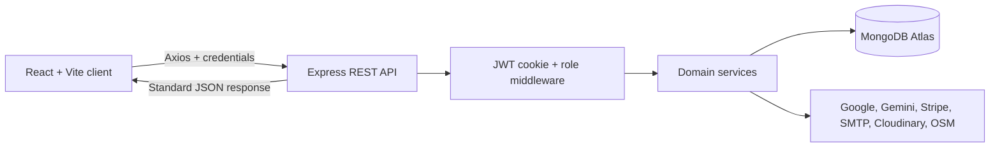

# ProbashiCare

**Care across distance, coordinated in one secure workspace.**

ProbashiCare is a full-stack elderly-care coordination platform designed for
families living away from their loved ones in Bangladesh. It connects family
accounts, verified local caregivers, and administrators through caregiver
booking, health monitoring, care coordination, notifications, subscriptions,
and supporting services.

[](https://react.dev/)
[](https://nodejs.org/)
[](https://www.mongodb.com/atlas)
[](https://expressjs.com/)
[](https://stripe.com/)

- **Live application:** [probashicare.vercel.app](https://probashicare.vercel.app/)
- **API health:** [Render health endpoint](https://probashicare-tasrif67-api-2026.onrender.com/api/health)
- **Status:** Final academic demonstration release
- **Detailed local setup:** [LOCAL_SETUP.md](./LOCAL_SETUP.md)

> This project handles educational/demo health information. Wellness insights
> and alerts support care coordination and are not medical diagnoses.

## Why ProbashiCare

Families abroad often coordinate elderly care across phone calls, messages,
paper records, and separate payment channels. ProbashiCare brings those tasks
into one role-aware system: families can maintain a trusted care record,
caregivers can complete structured visits, and administrators can supervise the
platform without exposing one family's private information to another.

## Product capabilities

- Family email/password signup with mandatory email verification
- Family Google signup with server-side ID-token verification
- Seeded admin login with no public admin signup
- Caregiver registration with shared email verification
- Draft, submission, rejection, resubmission, and approval application states
- Private Cloudinary verification-document upload scaffold
- Admin caregiver review queue with approve/reject decisions
- Approved caregiver dashboard and profile/availability editing
- HTTP-only JWT session cookies
- Shared API error handling and reusable auth/role middleware
- Protected family/admin routes and the elderly-profile onboarding handoff
- Public landing page and responsive family, caregiver, and admin workspaces
- Caregiver marketplace with protected contact information and weekly availability
- One-time, scheduled recurring, and long-term caregiver bookings
- Family booking history/cancellation and caregiver accept/decline/complete workflow
- Doctor appointment planning with caregiver escorts and optional Google Calendar sync
  ([setup and troubleshooting](./GOOGLE_CALENDAR_INTEGRATION.md))
- Caregiver daily wellness reports with mood, meals, medicine, observations, and vitals
- Thirty-day vital trends, rule-based early alerts, and optional Gemini summaries
- Deduplicated in-app notifications for booking and wellness events
- Family account settings with protected email changes and re-verification
- Family subscriptions, prototype BDT payments, transaction history, and admin analytics
- Reusable Button, Card, Input, and Modal components
- Responsive light/dark interface with a no-flash persisted preference
- Shared design tokens with a scoped caregiver accent in both light and dark mode

The elderly role remains reserved for a future authentication flow. Caregiver
authentication is now active, but the operational dashboard remains locked until
an administrator approves the initial professional application.

## Project leadership and contribution

### Lead developer and project integrator

**Md. Imam Hasan** ([@TASRIF-67](https://github.com/TASRIF-67)) led the project architecture, core implementation, frontend
experience, backend integration, debugging, testing, Git integration, and cloud
deployment. The following assigned features were designed and implemented as
primary contributions:

1. **Elderly Health Profile Management** - linked family access, personal
   information, medical history, allergies, medications, chronic diseases,
   emergency contacts, authorization, and archive workflows.
2. **Gemini Wellness Insights and Early Health Awareness** - allow-listed data
   sanitization, Gemini summaries, deterministic fallback summaries, cache-aware
   regeneration, vital trends, and rule-based early alerts.
3. **In-app Notification System** - unread counts, paginated history,
   mark-one/mark-all actions, deep links, polling, and idempotent event creation.
4. **Family Subscription, Premium Access, and Payments** - Core/Premium
   entitlements, free trials, prototype transactions, Stripe sandbox Checkout,
   webhook verification, payment history, expiry synchronization, and admin
   business analytics.
5. **Family Account Management and Email Re-verification** - protected profile
   updates, current-password confirmation, duplicate-email protection, session
   invalidation, verification email delivery, and rollback on delivery failure.

### Cross-feature implementation and team support

In addition to the assigned features, the lead developer integrated, reviewed,
debugged, or substantially improved team-owned workflows so the final application
behaves as one consistent product. This work included:

- caregiver registration, verification, approval, profile, and availability flows;
- caregiver booking, schedule selection, check-in/check-out, completion, and history;
- anonymous caregiver ratings, feedback, complaints, and admin moderation;
- grocery/essential requests, cart-style item selection, purchase status, and
  privacy-aware Leaflet/OpenStreetMap store discovery;
- doctor-appointment planning, caregiver escorts, and Google Calendar integration;
- family, caregiver, and administrator dashboards, navigation, responsive UI,
  accessibility improvements, and shared loading/error/empty states;
- authentication email delivery, Google sign-in, deployment configuration, merge
  conflict resolution, smoke testing, and final branch integration.

This contribution record distinguishes primary feature ownership from
cross-feature integration while recognizing that the repository was completed as
a team academic project.

## Role-based feature map

| Workspace | Main capabilities |
| --- | --- |
| **Family** | Manage elderly profiles, browse and book caregivers, review schedules and completed care, rate caregivers, coordinate groceries and doctor visits, read wellness reports/alerts, manage subscription access, and update account security. |
| **Caregiver** | Register and verify an application, maintain professional availability, accept or decline bookings, check in/out, complete visits, submit step-based wellness reports, handle care tasks and grocery requests, and review anonymous feedback. |
| **Administrator** | Verify caregivers, manage users, inspect booking history, moderate feedback/complaints, review subscription payments, and monitor platform/business analytics. |

### Premium boundary

Core access preserves family records and ongoing-care actions. Premium access
unlocks new caregiver bookings and advanced wellness tools such as generated
summaries, early alerts, and thirty-day vital trends. Entitlements are enforced
by the backend; hiding a frontend button is never treated as authorization.

## System architecture



The application follows a vertical request flow:

```text
React page/component
-> frontend service
-> Express route
-> authentication/role/validation middleware
-> controller
-> domain service
-> Mongoose model and MongoDB
-> { success, data } response
-> React state and rendered UI
```

## Technology and integrations

| Layer | Technology |
| --- | --- |
| Frontend | React 19, React Router, Vite, Axios, reusable CSS design system |
| Backend | Node.js, Express 5, REST controllers, middleware, domain services |
| Database | MongoDB Atlas and Mongoose schemas, indexes, aggregation, transactions |
| Authentication | HTTP-only JWT cookies, bcrypt password hashing, Google Identity Services |
| Maps | Leaflet with OpenStreetMap-based geocoding/store discovery |
| AI assistance | Google Gemini with data minimization, timeout handling, and deterministic fallback |
| Payments | Stripe sandbox Checkout/webhooks and optional local prototype payments |
| Messaging | Nodemailer SMTP for verification, password reset, and account-security email |
| Files | Private Cloudinary caregiver verification-document scaffold |
| Calendar | Google Calendar service-account event integration with graceful fallback |
| Deployment | Vercel frontend, Render API, MongoDB Atlas database |

External providers are optional in local development where a fallback exists.
Credentials stay in ignored environment files or deployment secrets and must
never be committed.

## Repository structure

```text
probashicare/
|- frontend/
|  |- src/components/       reusable UI and feature components
|  |- src/context/          auth, theme, notification, and subscription state
|  |- src/pages/            public, family, caregiver, and admin pages
|  `- src/services/         Axios API contracts
|- backend/
|  |- config/               environment and provider configuration
|  |- controllers/          HTTP request/response orchestration
|  |- middleware/           authentication, roles, validation, and errors
|  |- models/               Mongoose schemas and indexes
|  |- routes/               REST endpoint definitions
|  |- services/             reusable business/provider logic
|  |- scripts/              seed, synchronization, and smoke-test commands
|  `- test/                 focused Node test suites
|- *.md                      setup, API, integration, and workflow guides
|- LOCAL_SETUP.md            complete Windows/local setup guide
`- render.yaml               Render API blueprint
```

## Caregiver Booking Workflow

Family accounts select an authorized elderly profile, a caregiver, a booking type,
and slots that match the selected date range. The backend expands recurring
schedules into exact occurrences, validates time ranges, and uses reservation
documents with unique indexes to prevent concurrent double-booking.

Caregivers review requests from their booking workspace and can accept, decline,
or complete valid transitions. Families can track current status, review paginated
history, and cancel eligible bookings. Administrators have a separate booking
history view across family and caregiver accounts.

Run booking verification with:

```bash
npm run test:bookings --prefix backend
npm run test:bookings:integration --prefix backend
```

## Caregiver Verification

Caregivers register separately from families and verify their email through the
shared verification service. Their application supports a professional bio,
skills, languages, experience, hourly/monthly rates, service area, repeatable
availability periods, and one private verification document. Submitted records
are read-only until an administrator approves them or returns them with a reason.

The shared signup surface includes a neutral Family/Caregiver segment. Both
direct signup URLs preselect the appropriate mode, while switching modes updates
the hero, form, and accent in place without a page reload. Google signup remains
available only in Family mode; caregivers must provide the dedicated application
registration fields and verify their email.

Cloudinary credentials are optional during initial development. With
`REQUIRE_CAREGIVER_DOCUMENT=false`, drafts and final submission work without a
document. The requirement can be enabled later alongside the three
`CLOUDINARY_*` values described in [LOCAL_SETUP.md](./LOCAL_SETUP.md).

## Elderly Profile Management

Authenticated family users can create and manage multiple linked elderly profiles.
Each record supports personal information, medical history, allergies, current
medications, chronic diseases, and emergency contacts. Family access is stored in
a separate owner/editor/viewer link model; the current creator receives owner
access, and every profile read or write verifies that link. Profiles are archived
rather than permanently deleted.

Run the repeatable development smoke test while the API is running:

```bash
npm run test:elderly-profiles --prefix backend
```

The test creates temporary family and profile records, verifies onboarding status,
updates and archives the profile, checks cross-family isolation, and removes its
temporary records.

## Wellness Reports and Insights

Approved caregivers can create a draft report for an assigned care visit, complete
the report through a step-based form, and submit it as a read-only family update.
Reports support mood, meals, medicine intake, blood pressure, blood sugar, weight,
and health observations. Families can review report history, thirty-day trends,
and rule-based early wellness alerts.

Gemini can produce a concise wellness summary from sanitized, allow-listed values.
If Gemini is unavailable, a deterministic local fallback is used. These summaries
and alerts are informational coordination aids, not medical diagnoses. See
[GEMINI_WELLNESS_INTEGRATION.md](./GEMINI_WELLNESS_INTEGRATION.md).

```bash
npm run test:wellness-reports --prefix backend
npm run test:wellness-insights --prefix backend
```

## Notifications and Email Verification

The notification bell shows unread booking and submitted-report updates for the
authenticated user. Notification event keys make retries idempotent so one domain
event does not create duplicate alerts.

Password-based family and caregiver accounts must verify their email. Gmail SMTP
can be configured with a Google App Password in `backend/.env`; never store that
password in Git. A family owner may update their name from **My account**. Changing
the sign-in email requires the current password, sends a new verification link,
and suspends account access until the new address is verified.

Test SMTP authentication and one real verification-style message with:

```bash
npm run test:email --prefix backend
```

## Coordinated care extensions

- **Care visit tasks:** families attach prioritized instructions to an elderly
  profile and caregivers update them during assigned visits.
- **Ratings and complaints:** a completed booking can receive one anonymous
  verified-family rating; caregivers see feedback without family identity and
  administrators handle complaints separately.
- **Essentials workflow:** caregivers build requests from a visual item catalog;
  families approve, record purchases, and monitor fulfillment. Receipts remain
  optional for realistic local purchasing.
- **Nearby store discovery:** location sharing is deliberate and optional;
  Leaflet displays OpenStreetMap results without automatically sending the
  elderly profile address.
- **Doctor visits:** families schedule external appointments, optionally assign
  a caregiver escort, and can synchronize events to an authorized Google Calendar.

## Administrator oversight

The administrator workspace separates operational concerns into focused views:
caregiver applications, users, bookings, ratings, complaints, payments, and
business analytics. Authorization is enforced on backend routes, while summary
queries use MongoDB aggregation and bounded pagination to avoid unmanageable
dashboard responses.

## Local setup

Requires Node.js 20+ and a MongoDB Atlas database.

1. Install the root helper dependency:

   ```bash
   npm install
   ```

2. Install both applications:

   ```bash
   npm run install:all
   ```

3. Use the versioned root [`.env.example`](./.env.example) as the template.
   Copy its backend section into `backend/.env` and its frontend section into
   `frontend/.env`, then replace every placeholder used by your setup.

   Development environment files are included locally and ignored by Git. Replace
   the MongoDB Atlas placeholders before starting the backend. SMTP may remain empty
   during development; verification links will be printed in the backend terminal.

4. In Google Cloud Console, create an OAuth 2.0 Web application. Add `http://localhost:5173` as an authorized JavaScript origin. Use the same client ID for `GOOGLE_CLIENT_ID` and `VITE_GOOGLE_CLIENT_ID`.

5. Seed the admin after setting `ADMIN_NAME`, `ADMIN_EMAIL`, and `ADMIN_PASSWORD` in `backend/.env`:

   ```bash
   npm run seed:admin --prefix backend
   ```

6. Start both applications:

   ```bash
   npm run dev
   ```

The frontend runs at `http://localhost:5173`; the API runs at `http://localhost:5000`.

After model or index changes, synchronize development data structures and plan
definitions:

```bash
npm run db:sync-indexes --prefix backend
npm run db:sync-subscription-plans --prefix backend
```

## Family Subscription and Stripe Sandbox Payments

One Family subscription covers all elderly profiles linked to that account.
Core access preserves stored care information and ongoing-care actions.
Premium unlocks new caregiver bookings and reusable wellness entitlements.

The explicit free trial lasts seven days. Plans are Day Pass, Monthly, and
Yearly, with manual renewal only.

Stripe-hosted Checkout is available in sandbox mode. Test transactions do not
move money, and Premium is activated only after a signed Stripe webhook. The
older prototype simulator remains an optional local fallback. Never enter real
card information while using test keys. See FAMILY_SUBSCRIPTION_DOCUMENTATION.md
for the required test keys and Stripe CLI command.

Families manage plans and paginated payment history from the Subscription page.
The My account page remains focused on identity and security. Administrators can
review platform-wide payments, generated transaction references, booking history,
and business summary metrics from dedicated admin tabs.

Run subscription verification with:

```bash
npm run test:subscriptions --prefix backend
npm run test:stripe --prefix backend
npm run test:subscriptions:integration --prefix backend
```

## Verification commands

Run the checks relevant to the feature you changed. Integration/smoke scripts
may create temporary development records and require the API plus a test-safe
MongoDB database.

```bash
# Frontend compilation
npm run build --prefix frontend

# Pure backend test suites
npm run test:bookings --prefix backend
npm run test:subscriptions --prefix backend
npm run test:stripe --prefix backend
npm run test:auth --prefix backend
npm run test:calendar-service --prefix backend

# API/database smoke checks
npm run test:elderly-profiles --prefix backend
npm run test:caregiver-applications --prefix backend
npm run test:bookings:integration --prefix backend
npm run test:caregiver-feedback --prefix backend
npm run test:wellness-reports --prefix backend
npm run test:wellness-insights --prefix backend
npm run test:groceries --prefix backend
npm run test:subscriptions:integration --prefix backend
```

Useful final checks before a commit:

```bash
node --check backend/server.js
git diff --check
git status
```

Do not run automatic dependency audit fixes immediately before a demonstration;
review breaking-version changes deliberately on a separate branch.

## API response convention

Successful endpoints return:

```json
{ "success": true, "data": {} }
```

Failures pass through the shared error middleware:

```json
{
  "success": false,
  "error": {
    "message": "Human-readable explanation",
    "details": null
  }
}
```

## Deployment

The React application is deployed on Vercel and the Express API is deployed as
a Render web service through [`render.yaml`](./render.yaml). Production data is
stored in MongoDB Atlas.

Important hosted configuration:

- `CLIENT_URL` must exactly match the Vercel origin so credentialed CORS works.
- `VITE_API_URL` must use the public Render URL ending in `/api`.
- Google OAuth must list the deployed Vercel URL as an authorized JavaScript origin.
- Stripe must send selected sandbox events to the public
  `/api/subscriptions/stripe/webhook` endpoint and Render must store that
  endpoint's signing secret.
- Render's free service can sleep while inactive, so the frontend request timeout
  may be increased through `VITE_API_TIMEOUT_MS` for demonstration use.
- All provider keys belong in deployment environment settings, never in Git.

The public `/api/health` route confirms that the API process is available without
exposing database or credential information.

## Documentation map

- [Local installation and troubleshooting](./LOCAL_SETUP.md)
- [Elderly Profile API](./ELDERLY_PROFILE_API_DOCUMENTATION.md)
- [Gemini wellness integration](./GEMINI_WELLNESS_INTEGRATION.md)
- [Family subscriptions and Stripe](./FAMILY_SUBSCRIPTION_DOCUMENTATION.md)
- [Google Calendar integration](./GOOGLE_CALENDAR_INTEGRATION.md)
- [Git and team workflow](./GITHUB_TEAM_WORKFLOW.md)
- [Complete Git workflow](./COMPLETE_GIT_WORKFLOW.md)
- [Module 3 study guide](./MODULE_3_FEATURES_1_2_STUDY_GUIDE.md)

## Project media

Screenshots and a short walkthrough video can be added here later as a
documentation-only update. Recommended captures are the landing/authentication
experience, family dashboard, caregiver workspace, wellness insights, Stripe
test Checkout, and administrator analytics.

<!--
Example future screenshot path: docs/screenshots/family-dashboard.png

Example future video link:
[Watch the ProbashiCare walkthrough](https://example.com)
-->

## Extending the project

To add an API in an existing feature, define the controller contract and business logic, wrap it with `asyncHandler` in the feature route, then add a frontend service method that returns `response.data.data`. Expose the operation through a focused hook or context before consuming it in a page.

To add a model-backed feature, create the Mongoose schema in `backend/models`, then add its controller, routes, and `app.js` registration. Add the frontend service and a feature hook, and build pages from the shared design-system components.

The authentication onboarding status now queries active `ElderlyFamilyLink` and
`ElderlyProfile` records. Future family invitation work can activate the reserved
editor/viewer permissions without changing the profile document.
